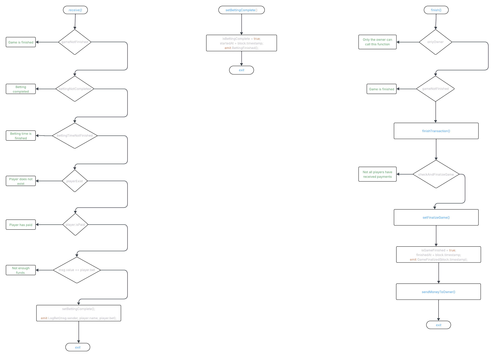

# Контракт игры на Solidity с использованием DelegateCall

Этот проект представляет собой смарт-контракт игры на Solidity, использующий паттерн DelegateCall для разделения логики и хранения данных.

## Архитектура

Проект разделен на три основных контракта:

1. **GameBase.sol** - базовый контракт, содержащий общую логику и хранение данных
2. **GameLogic.sol** - контракт с чистой логикой расчета выплат
3. **Game.sol** - основной контракт, наследующий GameBase

### Принцип разделения

Проект использует паттерн DelegateCall для разделения логики и хранения данных:
- Контракт хранения (GameBase) содержит все данные и состояния
- Контракт логики (GameLogic) содержит только чистые функции для расчетов
- При вызове функций логики используется delegatecall, что позволяет выполнять код из контракта логики в контексте контракта хранения



## Основные функции

### GameBase.sol
- `_init` - инициализация игры
- `_updateBettingStatus` - обновление статуса ставок
- `_finish` - завершение игры и распределение выигрышей
- `_receive` - получение ставок
- `_getPlayer` - получение информации об игроке
- `_getAllPlayers` - получение информации о всех игроках
- `_getGameData` - получение данных игры
- `_getContractBalance` - получение баланса контракта
- `_withdrawRemainingBalance` - вывод оставшихся средств
- `_abortGame` - отмена игры

### GameLogic.sol
- `calculatePayouts` - расчет выплат игрокам

### Game.sol
- `updateBettingStatus` - публичная функция обновления статуса ставок
- `finish` - публичная функция завершения игры
- `getPlayer` - публичная функция получения информации об игроке
- `getAllPlayers` - публичная функция получения информации о всех игроках
- `getGameData` - публичная функция получения данных игры
- `getContractBalance` - публичная функция получения баланса контракта
- `withdrawRemainingBalance` - публичная функция вывода оставшихся средств
- `abortGame` - публичная функция отмены игры

## Тестирование

Проект содержит 36 тестов, покрывающих все основные сценарии использования:
- Инициализация контракта
- Временные ограничения
- Обновление статуса ставок
- Управление балансом
- Отмена игры
- События
- Завершение игры
- Сценарии ставок
- Логика игры
- Множественные подключения

## Запуск

```shell
# Установка зависимостей
npm install

# Запуск тестов
npx hardhat test

# Запуск тестов с отчетом о газе
REPORT_GAS=true npx hardhat test

# Запуск локальной ноды
npx hardhat node

# Деплой контракта
npx hardhat ignition deploy ./ignition/modules/Game.ts
```

---

# Solidity Game Contract with DelegateCall

This project is a Solidity smart contract game that uses the DelegateCall pattern to separate logic and data storage.

## Architecture

The project is divided into three main contracts:

1. **GameBase.sol** - base contract containing common logic and data storage
2. **GameLogic.sol** - contract with pure payout calculation logic
3. **Game.sol** - main contract inheriting from GameBase

### Separation Principle

The project uses the DelegateCall pattern to separate logic and data storage:
- Storage contract (GameBase) contains all data and states
- Logic contract (GameLogic) contains only pure calculation functions
- When calling logic functions, delegatecall is used, allowing code from the logic contract to be executed in the storage contract's context


## Main Functions

### GameBase.sol
- `_init` - game initialization
- `_updateBettingStatus` - betting status update
- `_finish` - game completion and winnings distribution
- `_receive` - bet reception
- `_getPlayer` - get player information
- `_getAllPlayers` - get all players information
- `_getGameData` - get game data
- `_getContractBalance` - get contract balance
- `_withdrawRemainingBalance` - withdraw remaining funds
- `_abortGame` - abort game

### GameLogic.sol
- `calculatePayouts` - calculate player payouts

### Game.sol
- `updateBettingStatus` - public function for updating betting status
- `finish` - public function for completing the game
- `getPlayer` - public function for getting player information
- `getAllPlayers` - public function for getting all players information
- `getGameData` - public function for getting game data
- `getContractBalance` - public function for getting contract balance
- `withdrawRemainingBalance` - public function for withdrawing remaining funds
- `abortGame` - public function for aborting the game

## Testing

The project contains 36 tests covering all main usage scenarios:
- Contract initialization
- Time restrictions
- Betting status updates
- Balance management
- Game abortion
- Events
- Game completion
- Betting scenarios
- Game logic
- Multiple connections

## Running

```shell
# Install dependencies
npm install

# Run tests
npx hardhat test

# Run tests with gas report
REPORT_GAS=true npx hardhat test

# Run local node
npx hardhat node

# Deploy contract
npx hardhat ignition deploy ./ignition/modules/Game.ts
```


